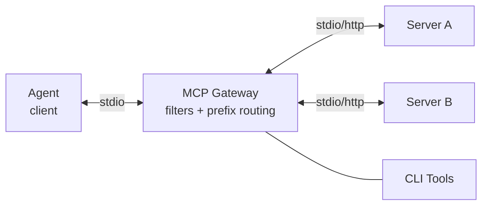

# MCP Gateway

[](https://github.com/itolosa/mcp-gateway/actions/workflows/pipeline.yml)
[](https://app.codacy.com/gh/itolosa/mcp-gateway/dashboard?utm_source=gh&utm_medium=referral&utm_content=&utm_campaign=Badge_grade)
[](https://github.com/itolosa/mcp-gateway/actions/workflows/pipeline.yml)
[](https://github.com/itolosa/mcp-gateway/actions/workflows/pipeline.yml)

A security proxy for [Model Context Protocol](https://modelcontextprotocol.io/) (MCP) servers. It sits between an AI agent and upstream MCP servers, exposing only an allowed subset of tools — so you can grant an agent access to powerful servers (GitHub, databases, cloud APIs) without giving it the keys to everything.

## Features

- **Multi-server aggregation** — connects to all registered servers, exposes a unified tool list with `server__tool` prefixed names
- **Tool filtering** — per-server allowlists and denylists control which tools the agent can see and call
- **CLI tools** — expose host commands (`gh`, `docker`, `kubectl`) as MCP tools without writing a server
- **Stdio and HTTP** — connects to upstream servers over stdio (child process) or HTTP/SSE
- **OAuth 2.1** — built-in authorization code flow with PKCE and automatic token refresh for HTTP upstreams
- **Zero unsafe code** — `#[forbid(unsafe_code)]`, strict clippy lints, 100% test coverage

## Install

**Homebrew (macOS / Linux):**

```bash
brew install itolosa/tap/mcp-gateway
```

**Cargo (from source):**

```bash
cargo install --path .
```

## Quick Start

**1. Register an upstream MCP server:**

```bash
# Stdio server (spawned as child process)
mcp-gateway add my-server -t stdio --command npx --args @modelcontextprotocol/server-filesystem --args /home/user

# HTTP server
mcp-gateway add remote-server -t http --url https://example.com/mcp
```

**2. (Optional) Restrict which tools are exposed:**

```bash
mcp-gateway allowlist add my-server read_file list_directory
mcp-gateway denylist add my-server delete_file
```

**3. Run the gateway:**

```bash
# Stdio (default) — use this in Claude Desktop / Claude Code mcpServers config
mcp-gateway run

# HTTP — start as a network server
mcp-gateway run --transport http --port 8080
```

The gateway connects to all registered servers and exposes their tools with prefixed names (e.g., `my-server__read_file`, `remote-server__search`). CLI tools are exposed without a prefix.

**4. (Optional) Authenticate OAuth-protected servers:**

```bash
# Authenticate all servers missing credentials
mcp-gateway oauth login

# Authenticate a specific server
mcp-gateway oauth login remote-server
```

## CLI Commands

| Command | Description | Example |
|---------|-------------|---------|
| `add <name> -t stdio` | Register a stdio server | `mcp-gateway add fs -t stdio --command npx --args @modelcontextprotocol/server-filesystem` |
| `add <name> -t http` | Register an HTTP server | `mcp-gateway add api -t http --url https://example.com/mcp` |
| `list` | List all registered servers | `mcp-gateway list` |
| `remove <name>` | Remove a registered server | `mcp-gateway remove fs` |
| `run` | Start the gateway in the foreground (default: stdio) | `mcp-gateway run` |
| `run --transport http` | Start the gateway with HTTP transport | `mcp-gateway run -t http --port 8080` |
| `start` | Start the gateway as a background daemon (HTTP) | `mcp-gateway start --port 8080` |
| `stop` | Stop the running daemon | `mcp-gateway stop` |
| `status` | Check if the daemon is running | `mcp-gateway status` |
| `restart` | Restart the daemon | `mcp-gateway restart` |
| `attach` | Attach to the daemon's log stream | `mcp-gateway attach` |
| `allowlist add <name> <tools...>` | Allow only specific tools | `mcp-gateway allowlist add fs read_file` |
| `allowlist remove <name> <tools...>` | Remove tools from the allowlist | `mcp-gateway allowlist remove fs read_file` |
| `allowlist show <name>` | Show a server's allowlist | `mcp-gateway allowlist show fs` |
| `denylist add <name> <tools...>` | Block specific tools | `mcp-gateway denylist add fs delete_file` |
| `denylist remove <name> <tools...>` | Remove tools from the denylist | `mcp-gateway denylist remove fs delete_file` |
| `denylist show <name>` | Show a server's denylist | `mcp-gateway denylist show fs` |
| `oauth login [name]` | Run OAuth flow for servers missing credentials | `mcp-gateway oauth login remote-api` |
| `oauth clear [name]` | Clear stored OAuth credentials | `mcp-gateway oauth clear remote-api` |

Use `-c <path>` (or `--config <path>`) on any command to override the default config file (`~/.mcp-gateway.json`).

## Configuration

All state lives in a single JSON file. The CLI commands manage it for you, but here is the full schema for reference:

```json
{
  "mcpServers": {
    "filesystem": {
      "type": "stdio",
      "command": "npx",
      "args": ["@modelcontextprotocol/server-filesystem", "/home/user"],
      "env": { "NODE_ENV": "production" },
      "allowedTools": ["read_file", "list_directory"],
      "deniedTools": ["delete_file"]
    },
    "remote-api": {
      "type": "http",
      "url": "https://example.com/mcp",
      "headers": { "X-Api-Key": "sk-..." },
      "allowedTools": [],
      "deniedTools": [],
      "auth": {
        "clientId": "my-app",
        "clientSecret": "secret",
        "scopes": ["read", "write"],
        "redirectPort": 9876,
        "credentialsFile": "/path/to/credentials.json"
      }
    }
  },
  "cliTools": {
    "gh-pr-list": {
      "command": "/usr/local/bin/gh-pr-list.sh",
      "description": "List open pull requests"
    }
  }
}
```

**Tool naming:** When the gateway runs, each upstream tool is prefixed with its server name using `__` (double underscore) as separator: `filesystem__read_file`, `remote-api__search`. This prevents collisions between servers that expose tools with the same name. CLI tools are exposed without a prefix. Filters operate on the raw (unprefixed) tool names — you configure `allowedTools: ["read_file"]`, not `allowedTools: ["filesystem__read_file"]`.

**Filtering rules:** When both lists are empty, all tools pass through. When `allowedTools` is non-empty, only those tools are visible. `deniedTools` always takes precedence — a tool in both lists is blocked.

**CLI tools:** Each entry maps a tool name to a host executable. The gateway pipes the full `tools/call` request as JSON to the command's stdin. The command writes its result to stdout (success) or stderr (error); exit code 0 means success.

**OAuth:** Add an `auth` object to an HTTP server entry. Run `mcp-gateway oauth login` to authenticate before starting the gateway, or the gateway will prompt automatically on first `run`. Tokens are cached to `~/.mcp-gateway/credentials/<server>.json` and refreshed automatically. Use `mcp-gateway oauth clear` to remove stored credentials.

## Architecture

MCP Gateway follows a ports-and-adapters (hexagonal) architecture. The core domain has no external dependencies — transport, storage, and filtering are plugged in at the edges via generics (compile-time DI, no dynamic dispatch).



## License

[Apache 2.0](LICENSE)
