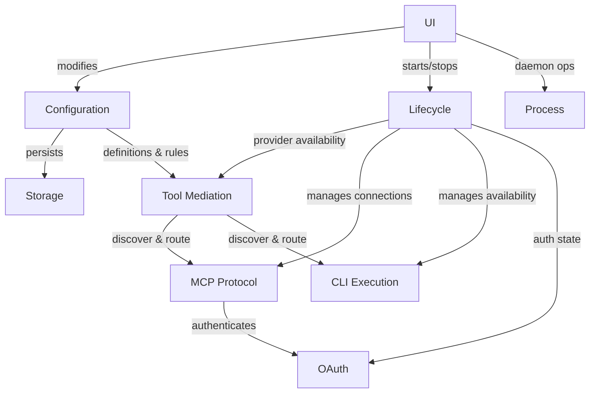
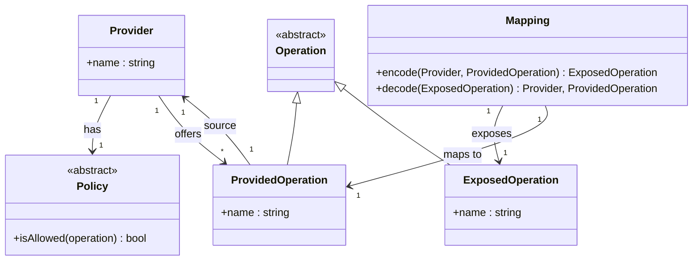
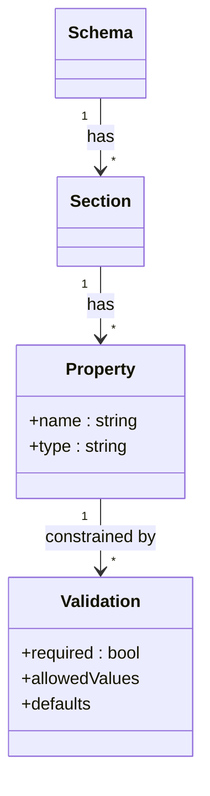
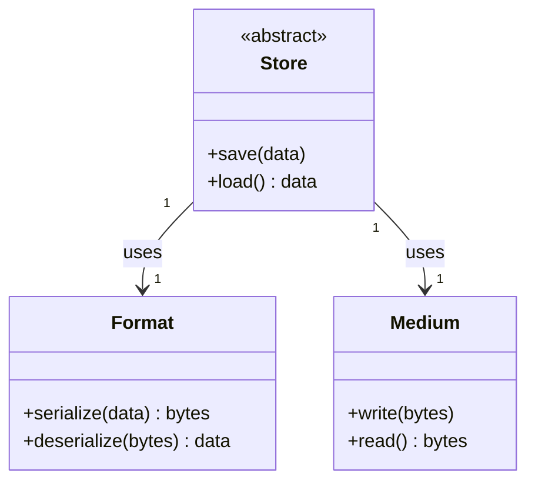
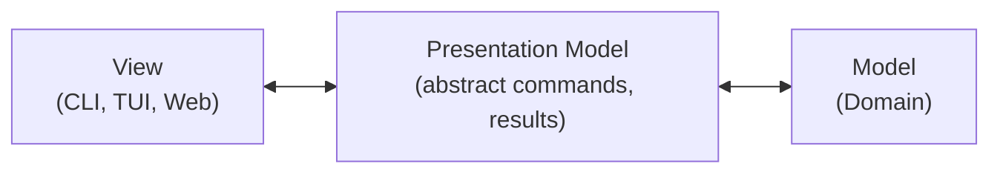
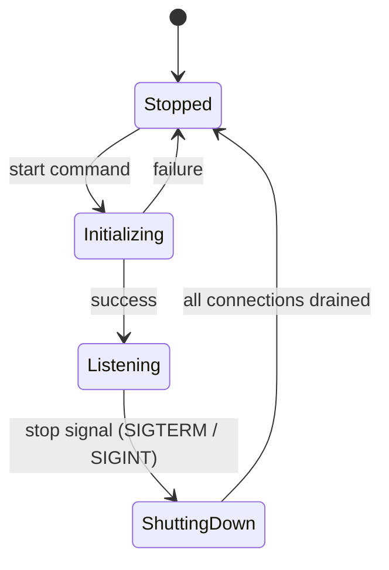
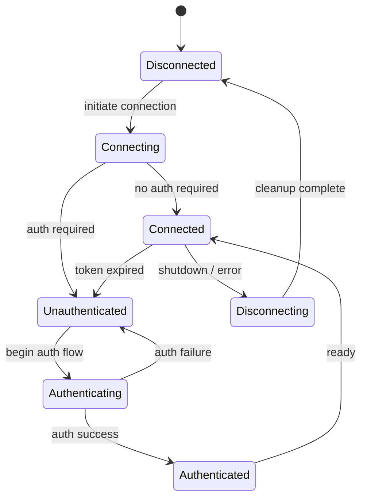

# MCP Gateway — Domain Model

Semantic model following the Shlaer-Mellor method: domain charting, semantic modeling, and domain abstraction.

This document is the **source of truth** for the domain model of MCP Gateway.

---

## Table of Contents

1. [System Overview](#1-system-overview)
2. [Domain Chart](#2-domain-chart)
3. [Bridge Map](#3-bridge-map)
4. [Domain: Tool Mediation](#4-domain-tool-mediation)
5. [Domain: Configuration](#5-domain-configuration)
6. [Domain: Storage](#6-domain-storage)
7. [Domain: UI](#7-domain-ui)
8. [Domain: Execution — Lifecycle](#8-domain-execution--lifecycle)
9. [Domain: Execution — Process](#9-domain-execution--process)
10. [Domain: Connectivity — MCP Protocol](#10-domain-connectivity--mcp-protocol)
11. [Domain: Connectivity — CLI Execution](#11-domain-connectivity--cli-execution)
12. [Domain: Connectivity — OAuth](#12-domain-connectivity--oauth)
13. [Vocabulary Reference](#13-vocabulary-reference)

---

## 1. System Overview

MCP Gateway is a proxy/firewall for Model Context Protocol (MCP) servers. It sits between clients and upstream providers, presenting a single unified set of operations to the client. The client does not see providers, servers, or anything behind the gateway — it only sees the operations exposed to it.

### Core Problem

The gateway **mediates** access to operations from multiple providers. It:

- Aggregates operations from multiple providers into a single catalog
- Applies policies to control which operations are exposed
- Routes operation calls to the correct provider
- Is transparent — it does not transform input or output data

### Key Design Decisions

- **All clients see the same operations** — there is no per-client differentiation
- **Configuration happens before runtime** — clients cannot modify the gateway
- **The gateway is stateless at the mediation level** — it discovers operations on the fly
- **Providers are abstract** — the gateway does not distinguish between remote MCP servers and local CLI commands at the mediation level; they are all just providers of operations

---

## 2. Domain Chart

### Application Domains

| Domain | Subject Matter |
|---|---|
| **Tool Mediation** | Routing and policy enforcement for operations between clients and providers |

### Service Domains

| Domain | Subject Matter | Vocabulary Source |
|---|---|---|
| **Configuration** | Defining the structure and rules of the system's setup | Standard (schema, section, property, validation) |
| **Storage** | Persisting and retrieving data | Standard (repository pattern, serialization) |
| **UI** | Human interaction with the system | Fowler's Separated Presentation + POSIX CLI conventions |

### Execution Domains

| Domain | Subject Matter | Vocabulary Source |
|---|---|---|
| **Lifecycle** | State machines of the gateway and its provider connections | Ours — modeled in this document |
| **Process** | Unix daemon mechanics: PID, signals, spawning | Unix daemon model |

### Connectivity Domains

| Domain | Subject Matter | Vocabulary Source |
|---|---|---|
| **MCP Protocol** | Wire protocol for communicating with MCP servers and clients | MCP Specification |
| **CLI Execution** | Running local commands as a source of operations | Unix process model |
| **OAuth** | Authorization flows for protected connections | OAuth 2.1 / RFC 6749 |

### Domain Classification Summary

```mermaid
block-beta
    columns 4
    block:Application:1
        A["Tool Mediation"]
    end
    block:Service:1
        B1["Configuration"]
        B2["Storage"]
        B3["UI"]
    end
    block:Execution:1
        C1["Lifecycle (ours)"]
        C2["Process (Unix)"]
    end
    block:Connectivity:1
        D1["MCP Protocol (spec)"]
        D2["CLI Execution (Unix)"]
        D3["OAuth (RFC)"]
    end
```

---

## 3. Bridge Map

### Bridge Definitions

| Client Domain | Service Domain | Purpose |
|---|---|---|
| Tool Mediation | Lifecycle | Which providers are currently usable (Connected state) |
| Tool Mediation | Configuration | Receives provider definitions, policy rules, mappings |
| Tool Mediation | Connectivity (MCP Protocol) | Discover and route operations on MCP providers |
| Tool Mediation | Connectivity (CLI Execution) | Discover and route operations on CLI providers |
| Configuration | Storage | Persist and load configuration data |
| UI | Configuration | Admin modifies configuration |
| UI | Lifecycle | Admin starts, stops, restarts the gateway |
| UI | Process | Admin triggers daemon operations |
| Lifecycle | Connectivity (MCP Protocol) | Manages MCP provider connections |
| Lifecycle | Connectivity (CLI Execution) | Manages CLI provider availability |
| Lifecycle | Connectivity (OAuth) | Authentication state of provider connections |
| MCP Protocol | OAuth | Authentication for HTTP-based MCP upstreams and downstreams |

### Bridge Diagram

### Direction of Connectivity Usage

- **Downstream** (client-facing): MCP Protocol, OAuth
- **Upstream** (provider-facing): MCP Protocol, CLI Execution, OAuth
- CLI Execution is **upstream only** — clients never connect via CLI
- MCP Protocol and OAuth serve **both directions**

---

## 4. Domain: Tool Mediation

**Classification:** Application domain (the core problem).

**Subject Matter:** Mediating access to operations between clients and providers. Routing calls, applying policies, managing the mapping between what providers offer and what clients see.

### 4.1 Objects

#### Provider

- **Identity:** name (unique string)
- **Description:** A source of operations. The gateway does not care whether a provider is a remote MCP server or a local CLI command — it is abstract at this level.
- **Note:** The provider's connectivity details (how to reach it) belong to the Connectivity domain, not here.

#### Policy (abstract)

- **Description:** Decides whether an operation is allowed. Policy is an abstract concept — it answers "is this operation permitted?" without prescribing how it decides.
- **Concrete implementations** (not part of Tool Mediation, but listed for context):
  - Allowlist Filter — only named operations pass
  - Denylist Filter — all operations except named ones pass
  - Compound Filter — combines allowlist and denylist
  - Future: rate limiting, read-only, role-based, etc.
- **Constraint:** Each Provider has exactly one Policy.

#### Operation (abstract)

- **Description:** The superclass for things that flow through the system. An operation is the general concept encompassing both queries (read, no side effects) and commands (write, side effects). Tool Mediation does not distinguish between them — it mediates both the same way.
- **Note:** "Tool" is MCP Protocol terminology. "Command" is CLI terminology. At the mediation level, both are Operations.

#### Provided Operation

- **Subtype of:** Operation
- **Description:** An operation as it exists on a Provider. Discovered at runtime by querying the provider. Not stored — ephemeral.
- **Attributes:** name (as known by the provider)
- **Relationship:** belongs to one Provider (its **source**)

#### Exposed Operation

- **Subtype of:** Operation
- **Description:** An operation as the client sees it. The unique name the client uses to discover and invoke operations.
- **Attributes:** name (unique across the entire system)

#### Mapping

- **Description:** Links one Exposed Operation to one Provided Operation. The mapping makes it possible to route a client's call to the correct provider and operation. Mapping also owns the naming logic — it knows how to encode a (Provider, Provided Operation) pair into an Exposed Operation name, and how to decode an Exposed Operation name back into a (Provider, Provided Operation) pair.
- **Constraint:** The mapping must be **reversible** — given an Exposed Operation name, the Mapping can recover the source Provider and the Provided Operation name.
- **Note:** Mappings are computable, not stored. The gateway is stateless at this level. The current implementation encodes the mapping in the Exposed Operation name using a prefix convention (`provider__operation`), but this is one strategy. The key invariant is reversibility.

### 4.2 Relationships

| Relationship | Description |
|---|---|
| Provider **has one** Policy | Each provider has exactly one policy governing its operations |
| Provider **offers many** Provided Operations | Discovered at runtime, not stored |
| Provided Operation **has one source** Provider | Every provided operation comes from exactly one provider |
| Mapping **links one** Exposed Operation **to one** Provided Operation | The routing link between what the client sees and what the provider offers |

### 4.3 Invariants

1. **Exposed Operation names are unique** across the entire system. No two Exposed Operations may share the same name.
2. **Mapping is reversible.** Given an Exposed Operation name, the system can always determine the source Provider and the Provided Operation name.
3. **Policy is always checked.** Both during discovery (to decide what to expose) and during routing (to decide whether to forward a call).

### 4.4 Behaviors

#### Discover

Query all Providers for their Provided Operations. For each Provider, apply its Policy. For each Provided Operation that passes the Policy, create a Mapping to an Exposed Operation. Return all Exposed Operations to the client.

- If a Provider is unreachable (Lifecycle reports it as not Connected), skip it — its operations are not included.
- If a Provided Operation is denied by Policy, no Mapping is created and it is not exposed.

#### Route

Given an Exposed Operation name from the client:

1. Use the Mapping to decode the Exposed Operation name into a Provider and Provided Operation.
2. Verify the Provider is usable (via Lifecycle bridge).
3. Check the Provider's Policy allows the Provided Operation.
4. Forward the call to the Provider through the Connectivity bridge.
5. Return the result to the client unchanged (the gateway is transparent).

- If the Mapping cannot be resolved, return an error.
- If the Provider is unknown or unavailable, return an error.
- If the Policy denies the operation, return an error.

### 4.5 Interaction with Other Domains

- **Lifecycle:** Tool Mediation asks Lifecycle "is this Provider usable?" before including it in Discovery or forwarding a Route. A Provider is usable only when its Connection state is **Connected**.
- **Configuration:** Tool Mediation receives Provider definitions, Policy rules, and Mapping configuration from the Configuration domain through a bridge. Configuration is consumed at startup.
- **Connectivity:** Tool Mediation delegates the actual communication with Providers to the Connectivity domain. It does not know whether a Provider speaks MCP over stdio, MCP over HTTP, or runs a local command.

---

## 5. Domain: Configuration

**Classification:** Service domain.

**Subject Matter:** The data that defines the system before it runs. Configuration is abstract — it knows about structure and validation, not about providers, policies, or connectivity.

**Vocabulary Source:** Standard configuration management concepts (schema, section, property, validation).

### 5.1 Objects

#### Schema

- **Description:** Defines the valid structure and constraints of the configuration. The top-level definition of what a correct configuration looks like.

#### Section

- **Description:** A grouping of related properties within the schema. Sections organize the configuration into logical units.
- **Relationship:** belongs to one Schema.
- **Note:** What each section represents (provider definition, filter rules, CLI tools) is interpreted by the consuming domains through bridges, not by Configuration itself.

#### Property

- **Description:** A named, typed entry within a section. The atomic unit of configuration.
- **Attributes:** name, type, constraints (required/optional, allowed values, defaults).
- **Relationship:** belongs to one Section.

#### Validation

- **Description:** Rules that enforce correctness of configuration data against the Schema. Validation ensures that data is structurally valid before it is provided to consuming domains.

### 5.2 Relationships

| Relationship | Description |
|---|---|
| Schema **has many** Sections | Top-level structure |
| Section **has many** Properties | Properties within a section |
| Property **has** Validation rules | Constraints on valid values |

### 5.3 Behaviors

#### Validate

Check data against the Schema. Reject if structurally invalid.

#### Provide

Supply validated configuration data to consuming domains through bridges. Configuration does not interpret the data — consuming domains give it meaning.

### 5.4 Bridge Interpretation

The consuming domains interpret configuration data as their own objects:

| Section/Property (Configuration) | Interpreted as (Consuming Domain) |
|---|---|
| Provider section | Provider definition (Tool Mediation) |
| Policy properties within a provider section | Policy rules (Tool Mediation) |
| Connectivity properties within a provider section | Connection details (Connectivity) |

### 5.5 Design Principle

Configuration is kept **abstract and generic**. If a new feature requires new configuration (e.g., logging settings), the Schema is extended with new Sections and Properties. Configuration itself does not change — only the Schema definition grows. The new consuming domain handles interpretation.

---

## 6. Domain: Storage

**Classification:** Service domain.

**Subject Matter:** Persisting and retrieving data. Storage is abstract — it does not know what the data means, only how to save and load it.

**Vocabulary Source:** Standard persistence patterns (repository pattern, serialization/deserialization).

### 6.1 Objects

#### Store (abstract)

- **Description:** The abstract interface for persistence: save and load. Consuming domains interact with Storage only through this interface.
- **API:** `save(data)`, `load() -> data`

#### Format

- **Description:** The serialization/deserialization rules. Defines how data is converted to and from a storable representation.
- **Examples:** JSON, YAML, TOML (current implementation uses JSON).

#### Medium

- **Description:** Where data physically persists.
- **Examples:** File system, database, in-memory (current implementation uses file system).

### 6.2 Relationships

| Relationship | Description |
|---|---|
| Store **uses a** Format | To serialize/deserialize data |
| Store **uses a** Medium | To persist/retrieve the serialized data |

### 6.3 Behaviors

#### Save

Serialize data using the Format, write to the Medium.

#### Load

Read from the Medium, deserialize data using the Format.

---

## 7. Domain: UI

**Classification:** Service domain.

**Subject Matter:** Human interaction with the system. Presenting information to an administrator and accepting commands.

**Vocabulary Source:** Martin Fowler's Separated Presentation pattern + POSIX/GNU CLI conventions.

### 7.1 Key Principles

From Fowler's **Separated Presentation**: the domain is completely unaware of the UI. The litmus test: "Imagine a completely different UI. If anything would be duplicated between a GUI and a CLI, move it to the domain."

From Fowler's **Presentation Model**: represent the state and behavior of the presentation independently of the specific UI controls. The Presentation Model is an abstract view that does not depend on the specific UI framework.

### 7.2 Objects (Abstract Level)

#### Presentation Model

- **Description:** The abstract state and behavior of the UI, independent of the rendering technology. What commands exist, what data they need, what results they produce.
- **Note:** The CLI (clap, terminal, flags) is one concrete View implementation of this abstract model. A web dashboard or TUI would be another.

#### Command (abstract)

- **Description:** An action the administrator wants to perform. Not CLI-specific — this is the abstract intent.

#### Result

- **Description:** What comes back from executing a command: success, error, or data to display.

### 7.3 Objects (CLI Concrete Level — POSIX/GNU Conventions)

| Concept | Description |
|---|---|
| **Command** | The program itself (`mcp-gateway`) |
| **Subcommand** | The action (`add-server`, `list-servers`, `run`, `stop`) |
| **Options/Flags** | Modifiers (`--name`, `--verbose`, `-h`) |
| **Option-Arguments** | Values attached to flags (`--port 8080`) |
| **Positional Arguments** | Ordered values (`mcp-gateway remove-server myserver`) |
| **Standard Output/Error** | Where results and errors are rendered |

### 7.4 Architecture

- **View** — the actual CLI rendering (clap parsing, terminal output formatting)
- **Presentation Model** — abstract commands, results, state
- **Model** — the domain (Configuration, Tool Mediation, Lifecycle, etc.)

---

## 8. Domain: Execution — Lifecycle

**Classification:** Execution domain (ours — modeled here).

**Subject Matter:** The state machines of the running gateway and its provider connections.

### 8.1 Objects

#### Gateway Instance

- **Description:** The running gateway system. Singleton — there is only ever one.
- **Identity:** Implicit (singleton).

#### Provider Connection

- **Description:** The connection state of one provider. Each provider has its own independent lifecycle.
- **Identity:** Provider name.

### 8.2 Gateway Instance State Machine

**States:**

| State | Description |
|---|---|
| **Stopped** | Not running. No connections, no listeners. |
| **Initializing** | Loading configuration, connecting to providers, preparing to serve. |
| **Listening** | Accepting client connections, handling requests. The main operational state. |
| **Shutting Down** | Stop signal received. Draining connections, disconnecting providers, releasing resources. |

**Transitions:**

| From | To | Trigger |
|---|---|---|
| Stopped | Initializing | Start command from admin |
| Initializing | Listening | All initialization complete, ready to serve |
| Initializing | Stopped | Initialization failure |
| Listening | Shutting Down | Stop signal (SIGTERM, SIGINT, or admin command) |
| Shutting Down | Stopped | All connections drained, resources released |

### 8.3 Provider Connection State Machine

Provider connections have independent lifecycles. Some providers require authentication, others do not.

**States:**

| State | Description |
|---|---|
| **Disconnected** | No connection to the provider. Initial state. |
| **Connecting** | Establishing connection to the provider. |
| **Unauthenticated** | Connected at transport level but not yet authenticated. Only for providers requiring auth. |
| **Authenticating** | Authentication flow in progress (e.g., OAuth token exchange). |
| **Authenticated** | Authentication successful. Ready to transition to Connected. |
| **Connected** | Fully operational. Tool Mediation can discover and route operations through this provider. |
| **Disconnecting** | Gracefully closing the connection. |

**Key behaviors:**

- Authentication is **optional** — providers that don't require auth skip directly from Connecting to Connected.
- Tokens can **expire** — a Connected provider can transition back to Unauthenticated, triggering re-authentication.
- Authentication **failure** returns to Unauthenticated (not Disconnected), allowing retry.
- Provider connections are **independent** — one provider going down does not affect others.
- **Gateway Initializing** triggers all provider connections to start.
- **Gateway Shutting Down** triggers all provider connections to disconnect.

### 8.4 Relationships

| Relationship | Description |
|---|---|
| Gateway Instance **has many** Provider Connections | One per configured provider |
| Gateway Instance state **constrains** Provider Connection states | Provider connections can only be active while the gateway is Initializing or Listening |

### 8.5 Interaction with Tool Mediation

Lifecycle exposes provider availability to Tool Mediation through a bridge:

- A Provider is **usable** only when its Connection state is **Connected**.
- During **Discover**: Tool Mediation skips providers that are not Connected — their operations are not included.
- During **Route**: Tool Mediation rejects calls to providers that are not Connected.
- When a token **expires**: Lifecycle moves the connection to Unauthenticated. From Tool Mediation's perspective, the provider's operations disappear from Discovery and Route rejects calls — until re-authentication completes.

---

## 9. Domain: Execution — Process

**Classification:** Execution domain.

**Subject Matter:** Unix daemon process mechanics.

**Vocabulary Source:** Unix daemon model (`daemon(7)` man page, POSIX).

### 9.1 Objects (from Unix)

| Object | Description |
|---|---|
| **Daemon** | A long-running background process providing a service |
| **PID** | Process identifier — uniquely identifies a running process |
| **PID File** | A file storing the daemon's PID for management purposes |
| **Signal** | Inter-process communication mechanism (SIGTERM, SIGHUP, SIGINT) |
| **Port** | Network port the daemon listens on |

### 9.2 Key Signals

| Signal | Purpose in MCP Gateway |
|---|---|
| **SIGTERM** | Request graceful shutdown |
| **SIGINT** | Ctrl+C — same as SIGTERM in our context |
| **SIGHUP** | Potential future use: reload configuration |

### 9.3 Behaviors

| Behavior | Description |
|---|---|
| **Spawn** | Fork a new daemon process, detach from terminal, write PID file |
| **Stop** | Read PID file, send SIGTERM to the process |
| **Status** | Check if PID in PID file corresponds to a running process |
| **Restart** | Stop then Spawn |

---

## 10. Domain: Connectivity — MCP Protocol

**Classification:** Service domain (within Connectivity).

**Subject Matter:** The wire protocol for communicating with MCP servers and clients.

**Vocabulary Source:** [MCP Specification](https://modelcontextprotocol.io/specification/2025-11-25).

### 10.1 Objects (from MCP Spec)

#### Three Core Primitives

| Object | Description |
|---|---|
| **Tool** | A function the AI can call. The MCP term for an operation. |
| **Resource** | Structured data the AI can read. (Future — not yet mediated by gateway.) |
| **Prompt** | Reusable instructions that guide AI behavior. (Future — not yet mediated by gateway.) |

#### Wire Protocol

| Object | Description |
|---|---|
| **JSON-RPC Message** | The wire format — requests, responses, notifications |
| **Transport** | The connection mechanism: stdio, SSE, HTTP Streamable |

#### Key Methods

| Method | Description |
|---|---|
| `initialize` | Handshake between client and server |
| `tools/list` | Discover available tools |
| `tools/call` | Invoke a tool |
| `resources/list` | Discover available resources (future) |
| `resources/read` | Read a resource (future) |

#### Newer Spec Additions (November 2025)

| Object | Description |
|---|---|
| **Task** | Tracks long-running asynchronous work on the server |

### 10.2 Usage in MCP Gateway

- **Downstream** (client-facing): The gateway exposes itself as an MCP server to clients.
- **Upstream** (provider-facing): The gateway connects to upstream MCP servers as a client.
- The gateway currently mediates **Tools** only. Resources and Prompts are future extensions.

### 10.3 Note on Abstraction

At the Tool Mediation level, MCP Tools are just **Operations**. The translation between Operation (domain) and Tool (MCP Protocol) happens at the bridge between Tool Mediation and Connectivity.

---

## 11. Domain: Connectivity — CLI Execution

**Classification:** Service domain (within Connectivity).

**Subject Matter:** Running local commands as a source of operations.

**Vocabulary Source:** Unix process model.

**Direction:** Upstream only — clients never connect via CLI.

### 11.1 Objects (from Unix)

| Object | Description |
|---|---|
| **Command** | The program to execute (path + arguments) |
| **Environment** | Variables passed to the process |
| **Process** | A running instance of a command |
| **Standard Streams** | stdin (fd 0), stdout (fd 1), stderr (fd 2) |
| **Exit Code** | The only thing a process returns to its parent (0 = success) |

### 11.2 Interaction Pattern

1. Gateway sends input via **stdin** (operation arguments).
2. Command executes and writes output to **stdout**.
3. Gateway reads **stdout** as the operation result.
4. **Exit code** determines success (0) or failure (non-zero).
5. **stderr** captures error details on failure.

### 11.3 Note on Abstraction

At the Tool Mediation level, CLI commands are just **Providers** offering **Provided Operations**. The fact that they run as local processes is a Connectivity concern.

---

## 12. Domain: Connectivity — OAuth

**Classification:** Service domain (within Connectivity).

**Subject Matter:** Authorization flows for protected connections.

**Vocabulary Source:** [OAuth 2.1 (IETF Draft)](https://datatracker.ietf.org/doc/draft-ietf-oauth-v2-1/), [RFC 6749](https://datatracker.ietf.org/doc/html/rfc6749).

### 12.1 Objects (from OAuth Spec)

#### Roles

| Object | Description |
|---|---|
| **Resource Owner** | Entity that grants access (typically the admin) |
| **Resource Server** | Server hosting protected resources |
| **Client** | Application requesting access on behalf of the resource owner |
| **Authorization Server** | Server issuing access tokens |

#### Tokens and Grants

| Object | Description |
|---|---|
| **Access Token** | Credential for accessing protected resources (has scope, lifetime) |
| **Refresh Token** | Credential for obtaining new access tokens when they expire |
| **Scope** | The permissions an access token carries |
| **Grant** | The authorization mechanism (Authorization Code with PKCE, Client Credentials) |
| **Redirect URI** | Where the authorization server sends the user back after authorization |

### 12.2 Usage in MCP Gateway

- **Upstream:** The gateway acts as a **Client** when connecting to OAuth-protected MCP upstream servers. It performs the authorization flow to obtain tokens.
- **Downstream:** The gateway can act as a **Resource Server** when protecting its own MCP endpoint with OAuth — clients must authenticate to connect.
- **Token lifecycle:** Tokens expire. When they do, the Lifecycle domain transitions the Provider Connection to Unauthenticated, and OAuth handles re-authentication (refresh token or new authorization flow).

---

## 13. Vocabulary Reference

Quick-reference mapping of domain terminology across all domains.

### Cross-Domain Term Mapping

| Tool Mediation | MCP Protocol | CLI Execution | Configuration |
|---|---|---|---|
| Provider | Server | Command definition | Provider section |
| Policy | — | — | Filter rules (allowedTools, deniedTools) |
| Operation | — | — | — |
| Provided Operation | Tool (upstream) | Command output | — |
| Exposed Operation | Tool (downstream) | — | — |
| Mapping | Name prefix convention | Tool name | — |

### Key Principle: Vocabulary Boundaries

Each domain uses its own terminology. Translation happens at bridges:

- **Tool Mediation** speaks of Providers, Operations, Policies, Mappings.
- **MCP Protocol** speaks of Tools, Resources, Prompts, JSON-RPC Messages.
- **CLI Execution** speaks of Commands, Processes, Streams, Exit Codes.
- **OAuth** speaks of Clients, Tokens, Scopes, Grants.
- **Configuration** speaks of Schemas, Sections, Properties, Validation.
- **Lifecycle** speaks of Gateway Instance, Provider Connections, States.
- **Process** speaks of Daemons, PIDs, Signals.
- **UI** speaks of Presentation Models, Commands, Results.
- **Storage** speaks of Stores, Formats, Mediums.

Domains never leak their vocabulary into other domains. The bridge is where translation occurs.
